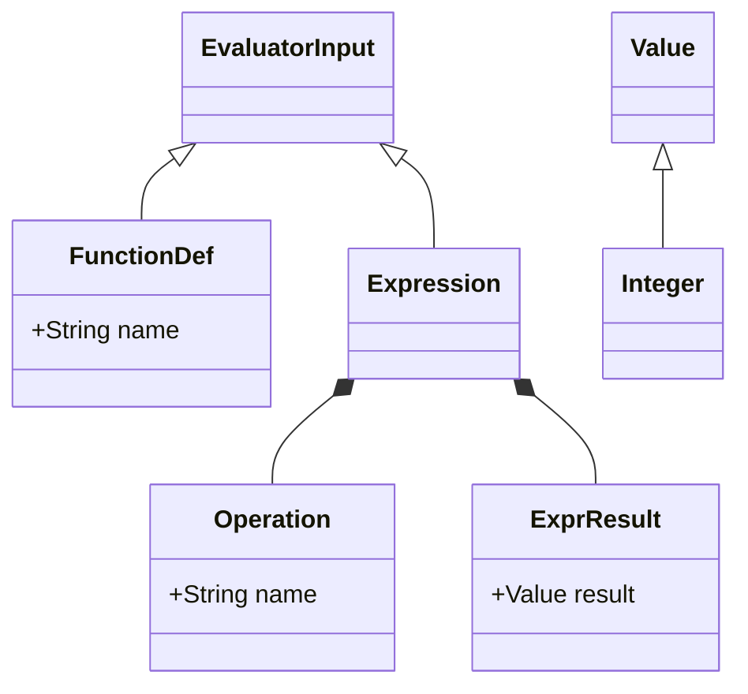

# Basic Evaluator source code

The grammar for the programming language being implemented is in the file 
[BasicEvaluator.g4](BasicEvaluatorParser/BasicEvaluator.g4).

After any changes to the grammar file, the lexer and parser code needs to be 
rebuilt using the following command in Linux:

```
antlr4 -no-listener -visitor -package BasicEvaluatorParser BasicEvaluator.g4
```

The command antlr4 is an alias in Linux set to:
```
java -jar /usr/local/lib/antlr-4.9.3-complete.jar
```

The antlr4 command will rebuild the Lexer and Parser, consisting of the following 
files:
- [BasicEvaluator.interp](BasicEvaluatorParser/BasicEvaluator.interp)
- [BasicEvaluator.tokens](BasicEvaluatorParser/BasicEvaluator.tokens)
- [BasicEvaluatorBaseVisitor.java](BasicEvaluatorParser/BasicEvaluatorBaseVisitor.java)
- [BasicEvaluatorLexer.java](BasicEvaluatorParser/BasicEvaluatorLexer.java)
- [BasicEvaluatorLexer.interp](BasicEvaluatorParser/BasicEvaluatorLexer.interp)
- [BasicEvaluatorLexer.tokens](BasicEvaluatorParser/BasicEvaluatorLexer.tokens)
- [BasicEvaluatorParser.java](BasicEvaluatorParser/BasicEvaluatorParser.java)
- [BasicEvaluatorVisitor.java](BasicEvaluatorParser/BasicEvaluatorVisitor.java)

The function main is located in the file [BasicEvaluator](BasicEvaluator.java).
This file contains the main Read-Eval-Print Loop which gets input from the user,
that consists of a set of lines containing one expression or function definition. 
The expressions or function definitions entered by the user are then parsed and
evaluated.  See the method named **parseInput** and 
**getParser** in this file to see how to use ANTLR to parse this language from the
string entered by the user at the REPL prompt.

Expressions are evaluated to a single Integer value and displayed as
output.  Function definitions are then parsed and then added to list of function
definitions available to subsequent expressions entered, and its name is displayed 
as output.

The following files were created to implement the Interpreter:
- [BasicEvaluatorVisitorImpl.java](BasicEvaluatorInterpreter/BasicEvaluatorVisitorImpl.java) - the 
implementation of the visitor which implements the main part of the Interpreter
- [EvaluatorInput.java](BasicEvaluatorInterpreter/EvaluatorInput.java) - the base 
class of the object that is returned from each visitor function, consisting of 
either the name of the function definition (**FunctionDef** class) or the value of 
the expression being evaluated (**ExprResult** class) 
- [Memory.java](BasicEvaluatorInterpreter/Memory.java) - contains the collections of variable values for
both the global and local environments (as a stack), as well as the function 
definitions
- [ValueEnvironment.java](BasicEvaluatorInterpreter/ValueEnvironment.java) - the 
class containing the Map of variable names to values for a single environment
- [FunctionDefinition.java](BasicEvaluatorInterpreter/FunctionDefinition.java) - 
the class containing a function definition
- [Value.java](BasicEvaluatorInterpreter/Value.java) - the class containing a 
value (an Integer)

To run the evaluator from the IntelliJ terminal, run the following command from
the **out/production/BasicEvaluator** folder, after building the project from
within the IDE:
```
java BasicEvaluator 
```

This will then display a prompt for the user to enter a function definition or
an expression to be evaluated.  The file [test01.lp](test01.lp) contains a set
of expressions and function definitions that can be entered at the prompt to 
test the Interpreter.

The BasicEvaluator programming language consists of values and function 
definitions.  It only supports one type of value and that is an Integer.  Variables
are stored in the global environment.  Variable names can contain any character
except spaces, open and close parentheses, a semicolon, or tabs, carriage returns,
or line feeds.  Parentheses are used to delimit expressions and function 
expressions, much like it does in the family of programming languages based on LISP.
Semicolons are used to start a comment which goes to the end of the current line.
When a function is called, the actual arguments passed to the function are 
evaluated to a value, and then the formal arguments of the function are set to 
these actual argument values inside a local environment for that function.  The 
**applyFunctionCall** method in the [BasicEvaluatorVisitorImpl.java](BasicEvaluatorInterpreter/BasicEvaluatorVisitorImpl.java) 
file shows this logic, which is the only complicated part of the Interpreter.
All other visitor functions used to implement the Interpreter are pretty 
straightforward.  The use of a stack for the local environments fully support 
recursive function calls.  The last function definition in the [test01.lp](test01.lp) 
file is a recursive function definition for the Greatest Common Divisor 
algorithm (gcd).

Below is a diagram of the type of the generic (EvaluatorInput) that the 
implemented Visitor uses, and that the only type of Value used by the evaluator 
is an Integer: 


### TODO
1. Better handling of parser errors
2. Add a **read** function to the language that reads input from the prompt
3. Add a **for** loop operation to the language
4. Experiment with passing values by reference during function calls, instead
   of by value, as it currently does.
5. Add a **load** function to the REPL that loads a file to be evaluated
6. Add local variables to functions
7. Add real numbers to the language
8. Implement static type-checking to the language as well as type-checking to
   distinguish between *statements* and *expressions* and between *procedures* 
   and *functions*
9. Updates to the REPL: a) history of commands and use of up/down arrow keys to
      go through history, b) auto-indent, c) better editing capabilities for multi-
      line command entry to edit lines above or below current line in command.